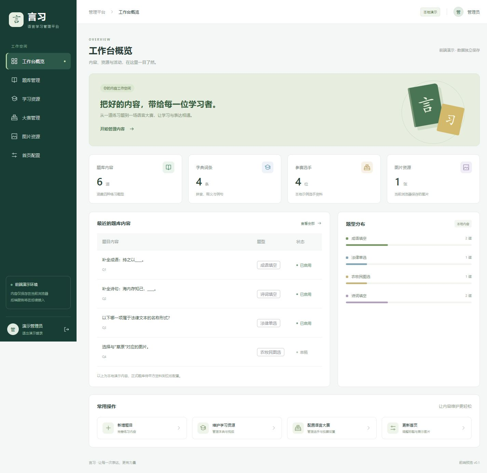
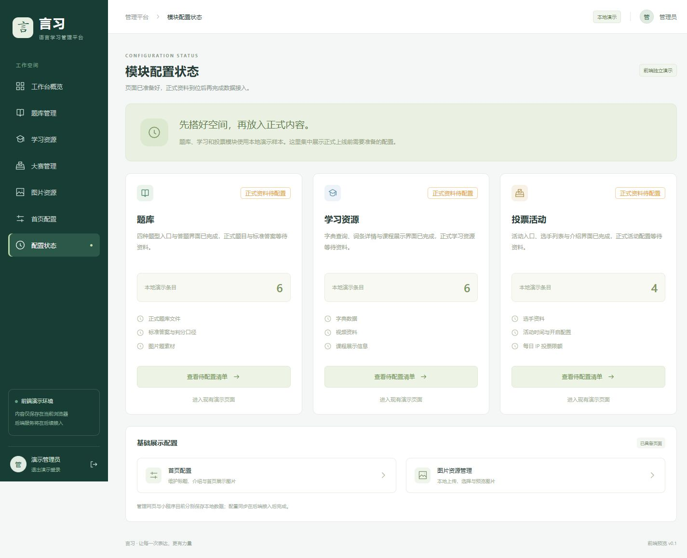

# 前端开发运行说明（Development Guide）

## 1. 当前交付

当前唯一计划为 [项目唯一实施计划](./2026-10-09-wechat-platform-plan.md)。本文件仅提供运行操作；审计和进度记录保留历史证据，不另行定义计划。

用户要求优先分别搭建小程序前端和管理网页。本阶段交付两个独立运行的前端项目，不启动原计划中的后端服务（Backend）、数据库（Database）、对象存储（Object Storage）或正式投票接口。

暂用项目名称“言习”，以米白、草木绿与浅金为视觉基调。甲方提供名称、标识（Logo）和品牌材料后，可调整页面文案与样式。

| 项目 | 路径 | 技术栈（Tech Stack） |
| --- | --- | --- |
| 网页管理后台（Admin Console） | `D:\work\26.10.9\all\apps\admin` | Vue 3、TypeScript、Vite、Vue Router、Element Plus |
| 微信原生小程序（WeChat Mini Program） | `D:\work\26.10.9\all\apps\miniprogram` | 原生 WXML、WXSS、TypeScript |
| 构建与检查工具（Build Tools） | `D:\work\26.10.9\all\tools` | Node.js 脚本 |
| 自动化测试（Automated Tests） | `D:\work\26.10.9\all\tests` | Node.js 内置测试运行器 |

依赖版本固定于各项目 `package.json` 与工作区锁文件（Lockfile）`pnpm-lock.yaml`。

## 2. 开发环境

- Node.js 22.18.0 或更高版本。本地验证使用 22.18.0；测试利用 Node.js 的 TypeScript 类型擦除（Type Stripping）能力。
- pnpm 10.14.0，已通过 `packageManager` 声明。
- 微信开发者工具，用于小程序原生编译、模拟器和真机预览；本次没有完成其运行验证。
- 此阶段不需要 Docker、PostgreSQL、MinIO 或任何云账号。

## 3. 管理网页启动

在 PowerShell 中执行：

```powershell
Set-Location 'D:\work\26.10.9\all'
pnpm install --frozen-lockfile
pnpm dev
```

访问 [本地管理网页](http://127.0.0.1:5173)。开发服务绑定 `127.0.0.1`，不向局域网开放；端口被占用时会明确报错，不自动切换端口。

演示账号：`admin`；演示密码：`demo2026`。该账号和页面路由守卫（Route Guard）仅用于前端交互，不可作为生产认证方案。退出登录后再访问内容页面会返回登录页。

| 页面 | 已实现交互 |
| --- | --- |
| 工作台概览 | 从当前本地数据计算内容数量、题型分布与最近题目；支持页面跳转 |
| 题库管理 | 搜索、题型／状态筛选、分页、新增、编辑、删除、启用状态 |
| 学习资源 | 字典与视频标签页（Tabs）；词条、视频信息的本地新增／编辑／删除 |
| 大赛管理 | 选手搜索与本地资料维护；活动名称、每日 IP 限额、04:00 刷新说明与开启配置 |
| 图片资源 | 本地上传、文件头类型检查、5 MiB 单文件上限、图片预览、删除 |
| 首页配置 | 标题、介绍、选择图片、手机封面预览、本地保存、恢复演示数据 |
| 配置状态 | 题库、学习与投票三个模块的状态总览，以及各自的待配置资料清单与演示页入口 |

### 本轮管理功能（Content Management）

- 题目编辑器（Question Editor）：选择题维护 2–8 个选项和正确答案，填空逐行维护接受的答案；图片题从图片资源或内置示例选择图片。缺少资料可保存草稿，但不能启用。
- Excel 导入预览（Import Preview）：题库页面点击“导入预览”，选择 .xlsx，调整工作表和列映射；错误带原始行号，有任何错误就禁止整批导入。默认拒绝重复，可明确选择按题型＋题干覆盖，保留原 ID。图片列使用地址，不读取内嵌图片；最终模板等甲方样本确认。
- 活动配置（Activity Settings）：按北京时间输入日期，转换成 UTC ISO 保存；开启需有效起止日期和整数日限额。真实投票仍禁用。选手支持照片、排序和展示状态。
- 学习资源管理（Learning Resource Management）：词条必填字段／排序／启用；课程分类可选择或新建，支持封面、时长、HTTPS 地址、排序与启用。无视频地址不能启用。
- 图片引用（Asset References）：首页、题目、选手或课程正在使用的库内图片不能直接删除。

本地缓存升级为版本 2，继续沿用原数据键以保留已有内容。旧选择题缺少选项时保留答案文本并转为草稿；首次写入前在 `yanxi-admin-demo-backup-before-v2` 保存旧缓存备份。此机制不替代生产数据库／对象存储备份。

前端 XLSX 使用 ExcelJS 4.4.0，按需加载；解析与导入限制为 10 MiB、2000 行、64 列。库说明见 [ExcelJS 官方仓库](https://github.com/exceljs/exceljs)。演示模板可在界面下载，示例文件在 `all/resources/question-import-demo.xlsx`。

后台数据保存在浏览器本地存储（Local Storage），键名为 `yanxi-admin-demo-v1`；登录状态在会话存储（Session Storage）中。数据不会提交到外部服务，也不会同步到小程序。

图片以数据 URL（Data URL）暂存于浏览器。浏览器总存储容量有限，单文件上限不代表可以保存任意数量的图片；写入失败会提示并保留原状态。此阶段的图片检查不替代未来服务端的文件校验。

## 4. 小程序构建与导入

```powershell
Set-Location 'D:\work\26.10.9\all'
pnpm build:mini
```

构建过程将 TypeScript 编译为小程序可用的 CommonJS，将 WXML、WXSS 和 JSON 复制到 `apps\miniprogram\dist`。

在微信开发者工具中：

1. 选择“导入项目”，项目目录为 `D:\work\26.10.9\all\apps\miniprogram`。
2. AppID 以项目当前配置为准；导入时确认该 AppID 可用且你拥有开发权限。若仍使用 `touristappid` 占位，换成可用的测试／实际 AppID。
3. 确认 `miniprogramRoot` 为 `dist/`，不要把 `src` 当作最终运行目录。
4. 编译并检查首页、练习、学习和我的四个标签页，以及首页的语言大赛入口。
5. 修改源文件后重新运行 `pnpm build:mini`；当前没有文件监听（Watch Mode）。

默认使用模拟请求（Mock Transport），本阶段不实际发起 `wx.request`，无需配置后端地址、服务端密钥或业务域名。统一请求服务（Request Service）已经建立，后续可以切换到真实 HTTP 接口。

| 页面 | 已实现交互 |
| --- | --- |
| 首页 | 永久可见的刷题、学习、投票入口；读取模拟配置的标题／介绍／图片；四类题型入口、词条入口与本地答题统计 |
| 考试题库刷题入口 | 成语填空、法律单选、农牧民图片选择题、诗词填空四个按钮，分别进入独立答题页；共 8 道静态题目 |
| 答题页 | 两套界面：填空输入、单选选项；选中高亮、提交判分、标准答案与说明、下一题 |
| 结果页 | 本次答题总数、答对／答错、正确率、重新练习、查看记录 |
| 学习页 | 搜索词语或拼音、空结果、视频课程占位提示 |
| 字词详情 | 拼音、释义、例句，以及无效词条状态 |
| 语言大赛 | 搜索选手、进入详情、每日额度规则说明 |
| 选手详情 | 文字头像占位、简介；投票按钮明确禁用 |
| 我的学习 | 最近 30 次本地练习记录、累计统计、清空记录确认 |
| 页面预览设置 | 切换正常、慢加载、空数据、加载失败四种场景；修改本地首页标题、介绍和图片 |

首页、学习与投票页面共用加载、空数据和请求失败组件（Page State Component）。请求失败可点击“重试加载”，空数据可点击“刷新内容”；重新请求时清除旧列表，后到的旧请求不能覆盖新结果。首页图片加载失败时显示默认封面。

### 状态与配置预览（State Preview）

从首页的“页面展示预览设置”或“我的学习”的“页面展示预览”进入设置页面。选择场景后点击“保存并查看首页”：

- 正常内容（Normal）：读取独立小程序预览配置与本地示例资源。
- 慢速加载（Slow）：延迟约 2.5 秒返回内容，便于观察加载状态（Loading）。
- 空数据（Empty）：显示资料待配置状态，不保留之前的示例列表。
- 加载失败（Error）：模拟请求失败，并提供重试入口。切回正常场景后可恢复展示。

页面预览配置保存在小程序存储键 `yanxi-mini-preview-v1`，与练习记录分开。标题、介绍与本地图片通过模拟接口 `/api/public/home` 的响应结构展示；这用于预演后台配置的读取流程，**当前没有实际读取管理网页保存的配置，也没有跨端同步**。

统一请求封装在 `src/services/request.ts`，其核心在 `src/domain/request-client.ts`；页面状态处理在 `src/domain/resource.ts`。模拟接口由 `src/services/mock-transport.ts` 提供，返回 `{data:...}` 或 `{error:{code,message,requestId}}`。真实 HTTP 模式预留在 `src/config/env.ts`，默认 `mode:'mock'`；后续完成服务后再设置 `mode:'http'` 和 `apiBaseUrl`。

### 管理后台待配置页面（Pending Configuration）

访问 [模块配置状态](http://127.0.0.1:5173/#/configuration) 查看模块总览：

| 模块 | 专用页面 | 显示内容 |
| --- | --- | --- |
| 题库 | `#/questions/pending` | 正式题库、标准答案／判分口径、图片题素材 |
| 学习 | `#/learning/pending` | 字典数据、视频资料、课程展示信息 |
| 投票 | `#/voting/pending` | 选手资料、活动时间、每日 IP 投票限额 |

每页有返回配置总览和进入现有演示页面的入口。原题库、学习与大赛编辑页面保留，并增加“查看待配置清单”提示。正式资料未到位，不把本地示例条目标记成正式配置已完成。

小程序练习记录存储键为 `yanxi-mini-history-v1`。演示填空答案只忽略前后空格，不做语义判分（Semantic Grading）。图片选择题使用本地 PNG 插画，不依赖网络；后续可替换为甲方图片。

### 考试题库刷题（Exam Practice）

| 按钮入口 | 题型（Answer Kind） | 独立答题路由 |
| --- | --- | --- |
| 成语填空 | 填空（Fill-in-the-blank） | `/pages/idiom-quiz/index` |
| 法律单选 | 选择（Single Choice） | `/pages/law-quiz/index` |
| 农牧民图片选择题 | 图片选择（Image Choice） | `/pages/image-quiz/index` |
| 诗词填空 | 填空（Fill-in-the-blank） | `/pages/poetry-quiz/index` |

每类题目包含 2 道静态样本。点击“练习”标签页进入四按钮页面，也可从首页直接进入对应题型。选择题一次只能选择一个选项，提交后标注正确／错误选项并锁定答案；填空题支持文字输入，输入为空时不能提交。提交后查看结果反馈，再进入下一题；完成整组后进入成绩页，可重新练习。

四个答题页复用 `src/domain/quiz-page.ts` 的答题流程，以及 `src/templates/choice-fields.wxml` 和 `fill-fields.wxml` 两套表单。旧的 `/pages/quiz/index?type=...` 路由保留兼容，新入口不再使用该路由。

静态题目位于 `src/data/demo.ts`，图片位于 `src/assets/questions`。修改题目后执行 `pnpm build:mini`。如需重新生成示例插画，从 `all` 运行 `node tools/create-question-images.mjs`，再构建小程序。

## 5. 验证与构建命令

均从 `D:\work\26.10.9\all` 执行：

```powershell
pnpm typecheck
pnpm build
pnpm test
pnpm verify:mini:templates
```

- `typecheck`：后台、小程序与服务端 TypeScript 类型检查。
- `build`：生成管理网页、小程序以及服务端编译产物（Build Artifacts）。
- `test`：前端测试后运行真实 PostgreSQL 与本地 S3 兼容服务的 HTTP 集成测试（Integration Tests）；也可分别执行 `test:frontend`、`test:server`。
- `verify:contracts`：检查 `shared/contracts.ts` 与小程序生成契约一致；不得手工修改 `src/contracts/generated.ts`。
- `verify:mini:templates`：检查页面文件、标签、表达式语法、页面 JSON、标签页路由以及共享模板引用；属于静态结构检查（Static Validation），不替代微信原生模板编译。

小程序页面流程测试运行真实编译后的页面代码，以测试用微信 API 边界（Test Double）模拟存储、提示和跳转。它验证页面状态与记录行为，不模拟微信原生渲染器（Native Renderer）。

## 6. 后续后端接入位置

修改接口前先查看唯一 plan 的 C-01..C-04 联动表，统一类型／运行时解码源位于 `all/shared/contracts.ts`。小程序生成文件在构建前同步；管理端直接使用这些模型。

代码中的 `[PRE-LAUNCH:PL-xx]` 标明当前演示逻辑的替换要求，`[CONTRACT:C-xx]` 标明同步修改位置。搜索标记可以找到登录、缓存、媒体、导入、活动与发布配置的待办；真实服务上线任务仍未关闭。

- 后台当前集中在 `apps\admin\src\stores\demo.ts` 维护演示状态，可按模块逐步替换为后端接口调用与加载／错误状态。新增配置状态页只展示准备情况，不会自动上传资料或变更生产配置。
- 后台示例类型定义在 `apps\admin\src\data\seed.ts`；这些是页面展示模型（View Model），不应直接当作正式数据库结构。
- 小程序样本集中在 `apps\miniprogram\src\data\demo.ts`，本地记录集中在 `src\services\local.ts`；首页、学习与投票已通过统一请求服务（Request Service）消费模拟数据，后续替换模拟传输层（Mock Transport）并确认真实响应字段。
- 需要接入真实管理员认证、题库与标准答案、图片存储、字典／视频和比赛活动。
- 投票限制必须由服务端执行，按 IP、北京时间每天 04:00 切换投票日（Business Day）；前端配置不会产生真实限额效果。正式额度尚未确定。
- 已完成本地 Excel 导入预览和确认保存；服务端导入、正式模板、导出、真实视频播放／统计与跨端同步仍留待后续。

## 7. 预览

管理后台桌面预览：



新增模块配置状态总览：



## 8. 首页真实服务试验（Home Service Trial）

本节描述新增服务模式（Service Mode）。此前章节的账号、本地缓存和预览说明只适用于演示模式（Demo Mode）。完整范围和接口以唯一 plan 第 10 节为准。

### 无 Docker 的本地启动（Local Startup）

在 `D:\work\26.10.9\all` 安装依赖后，按以下顺序操作：

1. 第一个终端运行 `pnpm dev:infra` 并保持运行。工具在 `.runtime/development` 启动实际 PostgreSQL 17.6 与本地 S3 测试服务，配置写入被 Git 忽略的 `.env`，重复启动保留数据。首次生成随机管理员密码，不在终端输出。
2. 第二个终端依次运行 `pnpm db:migrate`、`pnpm --filter server build`、`pnpm init:admin`、`pnpm dev:server`。数据库迁移（Migration）可重复运行；管理员初始化不会覆盖已有密码。
3. 第三个终端运行 `pnpm dev`，打开 `http://127.0.0.1:5173`。已有开发服务需重启以读取 `.env` 中的 `VITE_ADMIN_MODE=service`。管理员账号密码在本机 `.env` 中查看，不要提交或截图分享该文件。
4. 在“图片资源”上传图片，在“首页配置”选择图片并保存标题与介绍。首页与图片保存到服务；题库、学习、投票和概览中的示例统计仍是本地演示。

服务默认端口 3000，依赖端口 55432、59000。如端口被占用，先处理占用或调整工具配置；不自动结束无关进程。私有图片通过同源 `/api/admin` 代理预览，公开首页图片地址由 `PUBLIC_BASE_URL` 生成。首次数据库没有首页配置时，公开首页返回 null，小程序显示空状态。

开发网页代理现从同一根环境读取后端 `PORT`。更改端口时同步 `PUBLIC_BASE_URL`，重启后台网页和服务；生产的容器映射、健康检查与反向代理端口仍需按唯一 plan 一起核对。

服务模式下，“图片资源”供真实首页使用；题目、课程、选手演示编辑器通过“添加本地演示图片”上传到原浏览器缓存，支持选择与刷新保留。两类图片库保持独立。认证查询发生 503／网络故障时会保留当前页面并显示“重新连接”，不会把连接故障当作密码错误或改成本地保存。

Windows 下运行中的 Prisma 服务会锁定引擎文件。重新生成客户端、类型检查或构建之前，先停止 `dev:server`，检查结束后再启动；不要强制删除 DLL。

本地 S3 服务（S3rver）只用于开发／测试，生产使用实际 S3 兼容存储与私有桶（Private Bucket）。服务上传会实际解码并重新编码为 PNG；格式和大小限制详见唯一 plan，上传文件名不是对象路径。

### 小程序首页接入（Mini Program Home Integration）

在 `all` 的 PowerShell 终端执行：

```powershell
$env:MINI_HOME_MODE = 'http'
$env:MINI_API_BASE_URL = 'http://127.0.0.1:3000'
pnpm build:mini
```

然后在微信开发者工具导入 `all/apps/miniprogram` 并重新编译。上述地址只适用于本机开发者工具；真机要使用手机可访问的局域网或 HTTPS 地址，同时将 `.env` 的 `PUBLIC_BASE_URL` 改为手机可访问地址并重启后端，让首页图片地址也可访问。微信网络域名设置与真机操作仍需单独验收。

此开关只让首页请求真实接口，其他模块继续使用样本。配置写入构建产物，不修改源文件或 AppID；测试与普通构建默认是 Mock。在同一终端恢复默认构建时，移除这两个任务环境变量后重新构建。

### 容器与服务器准备（Container / Server Preparation）

`apps/server/Dockerfile` 包含后台静态页面与 Node 服务，`infra/compose.yaml` 包含 PostgreSQL、迁移和管理员初始化任务。`infra/nginx.conf.example` 是 HTTPS 反向代理（Reverse Proxy）模板。生产运行服务不持有管理员初始化密码。

正式环境另行准备 `.env`：数据库密码 `POSTGRES_PASSWORD` 使用 URL 安全字符，配置真实私有桶、存储密钥、HTTPS 公开地址与管理地址；本阶段管理页面采用同源部署。开发工具生成的本机地址和测试存储凭证不能直接用于该环境。

以下命令是部署准备步骤（Preparation），执行前应按唯一 plan 核对目标环境；本轮未在目标服务器执行：

```powershell
docker compose --env-file .env -f infra/compose.yaml up -d database
docker compose --env-file .env -f infra/compose.yaml run --rm migrate
docker compose --env-file .env -f infra/compose.yaml run --rm init-admin
docker compose --env-file .env -f infra/compose.yaml --profile app up -d server
```

配置真实域名、证书和私有对象存储后验证就绪接口。数据库尚未迁移或存储不可用时 `/api/health/ready` 返回 503。数据库使用命名卷（Named Volume）；备份恢复与升级回退尚未演练，不运行带卷删除的清理命令。

Linux 自动检查（CI）定义在 `.github/workflows/verify.yml`，覆盖干净安装、类型检查、构建、测试、模板、契约和 Docker 镜像构建。工作流文件存在不等于运行成功，实际结果需要单独确认。
